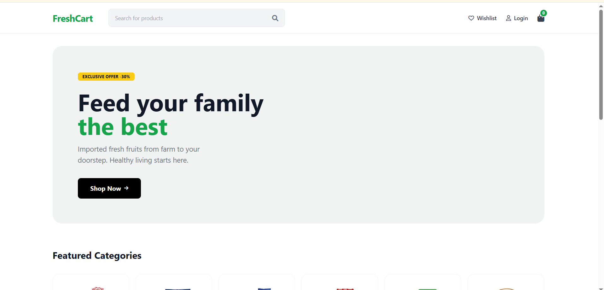
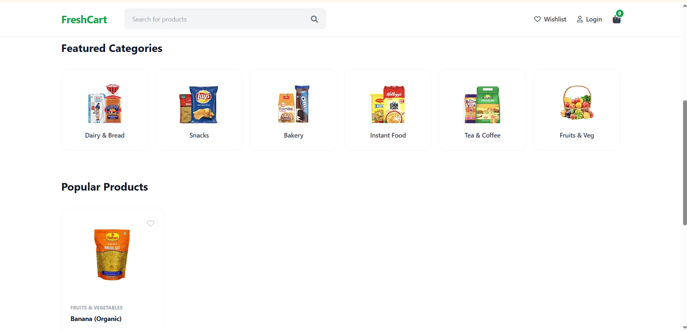
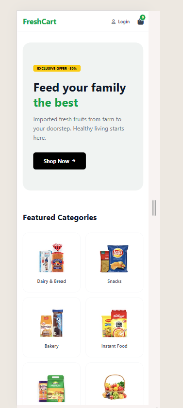
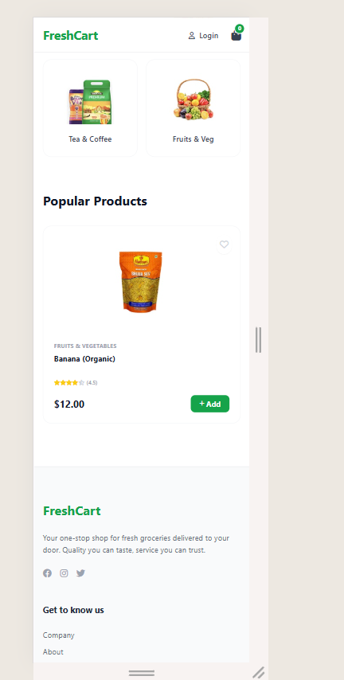
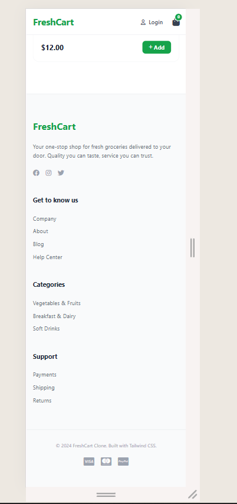

# FreshCart eCommerce Website Clone

A responsive grocery and eCommerce landing page clone of the FreshCart template. This project was developed to demonstrate semantic HTML structure and responsive web design using Tailwind CSS.

---

## Live Demo
* Live Link: [Insert Your GitHub Pages Link Here]
* Reference Design: https://themewagon.github.io/freshcart/

---

## Technical Requirements Fulfilled

* Clean and Semantic HTML: Utilized header, main, section, and footer tags for accessibility and SEO.
* Full Responsiveness: Implemented a mobile-first approach using Tailwind CSS breakpoints to ensure the layout adapts to mobile, tablet, and desktop screens.
* CSS Framework: Built entirely with Tailwind CSS via CDN for rapid utility-based styling.
* Design Fidelity: Followed the layout, color scheme, and typography of the provided reference link.

---

## Features

* Responsive Navigation: Includes a search bar that adjusts visibility based on device width and a sticky header for improved user experience.
* Hero Banner: A high-impact promotional section with call-to-action buttons.
* Category Grid: A dynamic grid system showing 6 items on desktop, 3 on tablets, and 2 on mobile devices.
* Product Cards: Feature-rich cards including hover transitions, badge overlays for discounts, and interactive buttons.
* Footer: A multi-column layout providing site information and social media links.

---

## Technologies Used

* HTML5
* Tailwind CSS
* FontAwesome Icons

---

## Project Structure

freshcart-clone/
├── assets/
│   ├── css/
│   └── images/      (Contains desktop and mobile screenshots)
├── index.html       (Main landing page)
└── README.md        (Documentation)

---

## Installation and Setup

1. Clone the repository:
   git clone https://github.com/your-username/freshcart-clone.git

2. Open the project directory:
   cd freshcart-clone

3. Run the project:
   Open index.html in any modern web browser.

---

## Screenshots

### Desktop View

### Mobile View

---

## Disclaimer
This project is for educational purposes as part of a Web Development assignment. All image assets are used for demonstration based on the provided reference link.